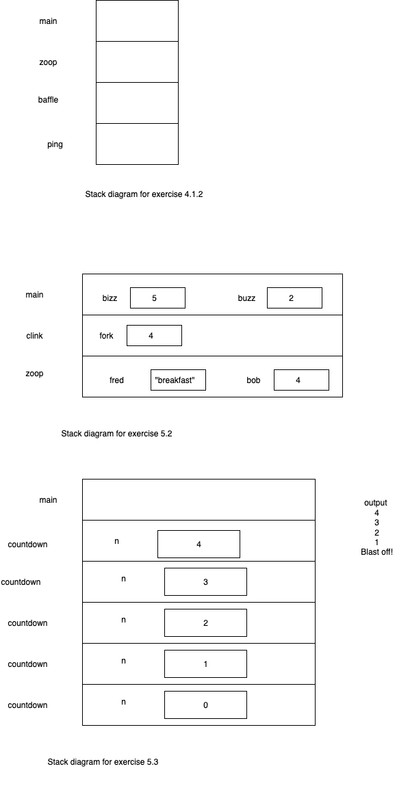

## Think Java 

- Java Fundamental sample programs.The chapters are shown as menu options. To see output of a chapter exercise select that option. 


### Features

- Chapter 1 (The way of the program)
- Chapter 2 (Variables and operators)
- Chapter 3 (Input and Output)
- Chapter 4 (Void methods)
- Chapter 5 (Conditional and logic)
- Chapter 6 (Value Methods)
- Chapter 7 (Loops)
- Chapter 8 (Arrays)
- Chapter 9 (Strings and things)
- Chapter 10 (Objects)
- Chapter 11 (Classes)


### Installation

For Windows:

```bash
run_jdf.bat
```

For Linux:

```bash
./run_jdf.sh
```

### Docker

The installation scripts use docker. If you do not have docker in your system please
refer to Docker [getting started](https://docs.docker.com/get-started/)
docs for more detail.


### Stack Diagram


